# Introduction

Doorlooker is a simple IoT door lock checker developed for our course in Singapore Polytechnic, IoT security. The project is developed with security in mind adhereing to TR64 standards.

Doorlooker is desgined for individuals suffering from paranoia, obsessive compulsive disorder (OCD) or Dementia, it provides a easy way for them to check whether door is locked or unlocked remotely, giving them a peace of mind instead of rushing back home to check which may inccur in undesired social or economical consequences.

# The Team

The project is a joint effort of the following 3:

- Jabez Tho Ngee Qi (1802315)
- Ryan Tan Kee Juay (1737172)
- Anthony See Teck Ho (1820148)

# Features of the product
- IR Doorlock sensing
- Telegram bot
- Admin alert
- Abnormalities logging and reporting

### IR Sensor combo
Two IR sensors lo

### Telegram bot
The telegram bot handles the inputs from the user as well as outputs to the user. There are many commands to use when inputting to the bot, they are as follow:
1. /register
   - Registers the user when the correct UUID has been keyed in
   - Adds user chat id from the database
   - Duplicate entering of UUID results in error
   - Indicates to user when device is already registered to their user id
   - All UUID is hashed with salt to prevent repudiation
2. /unregister
   - Unregisters the user when correct UUID has been keyed in
   - Removes user chat id from the database
   - Entering wrong UUID results in error
   - Indicates success when successfully unregistering
   - User will stop receiving updates from the unregistered device
   - All UUID is hashed with salt to prevent repudiation
3. /check
   - Lists all registered devices
   - Indicates its current state
   - States include:"disconnected from the internet", "door is locked", "door is unlocked"

The bot also will give a instant notification when there's a change of state of the door, for example when the door is unlocked after being locked, "'UUID': door is unlocked" will be shown to the user through telegram

### Infinite scaling and what each service does
AWS Lambda, Dynamodb, Cloudwatch, Device Defender Detect is used to execute reply function, store user data, log all execution of function and to check for violation of set rules respectively.

1. Lambda
   1. Receives user commands
   2. Sends reply messages
   3. Listens on RESTFUL API to get state change
   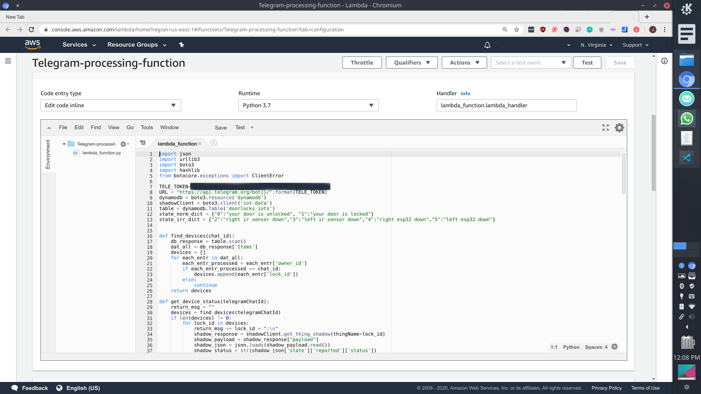
2. Dynamodb
   1. Stores factory made UUID keys
   2. Stores hashing salt
   3. Stores registered user IDs
   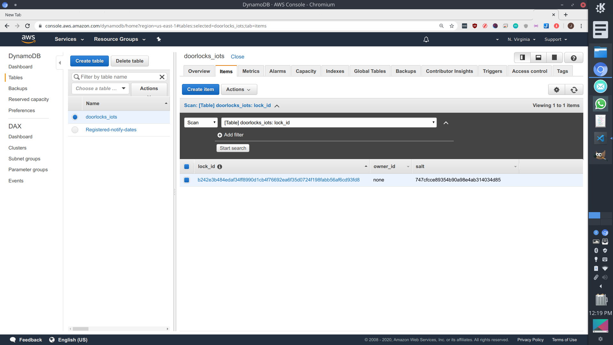
3. Cloudwatch
   1. All input MQTT, HTTPS messages are logged
   2. When an error or unusual network traffic is detected, it informs the administrators immediately
   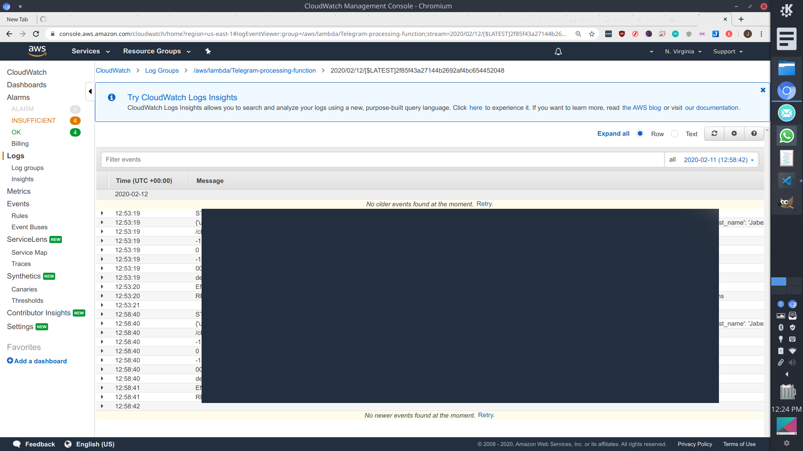
   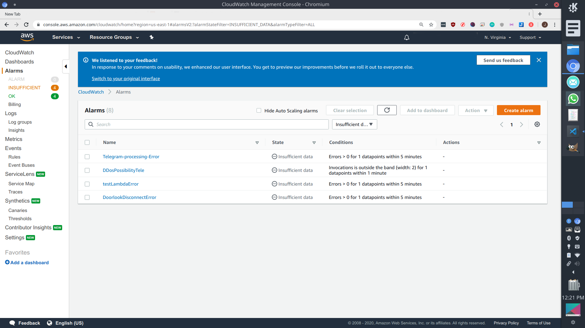
4. Device Defender Detect/Audit
   1. Checks for device regulation violation(etc. failed autorization)
   2. Automatic scheduled audits on IoT devices
   2. Push notification will be sent via SMS with AWS SNS to inform user
   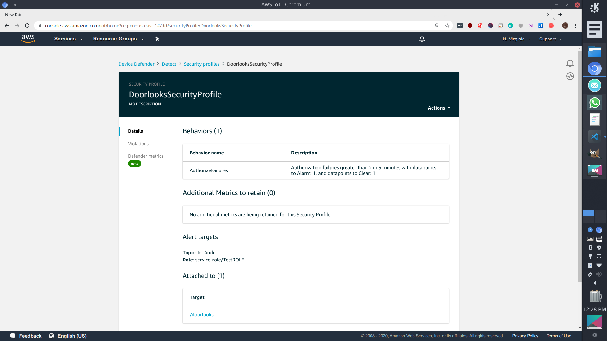
   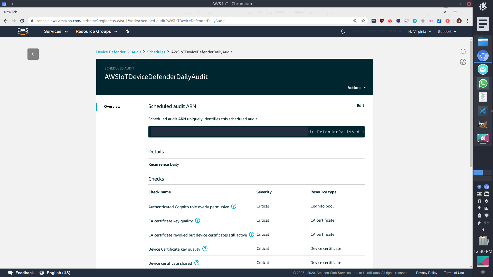
6. CloudTrail
   1. logs all suspicious aws api, sdk request
   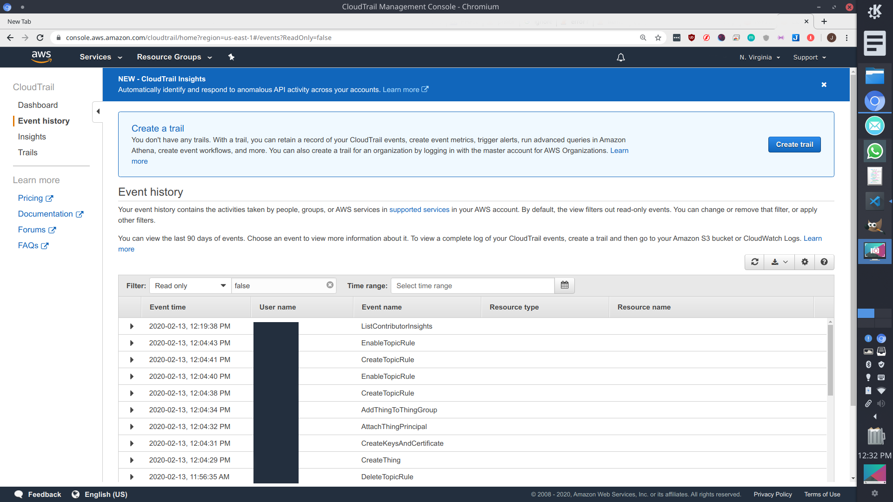

# Product Infrastructure

### Network diagram:
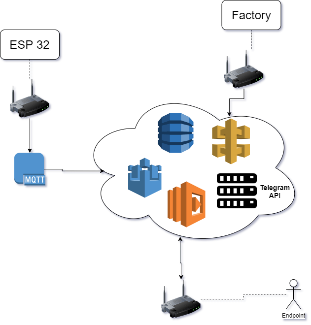

### Architecture diagram:
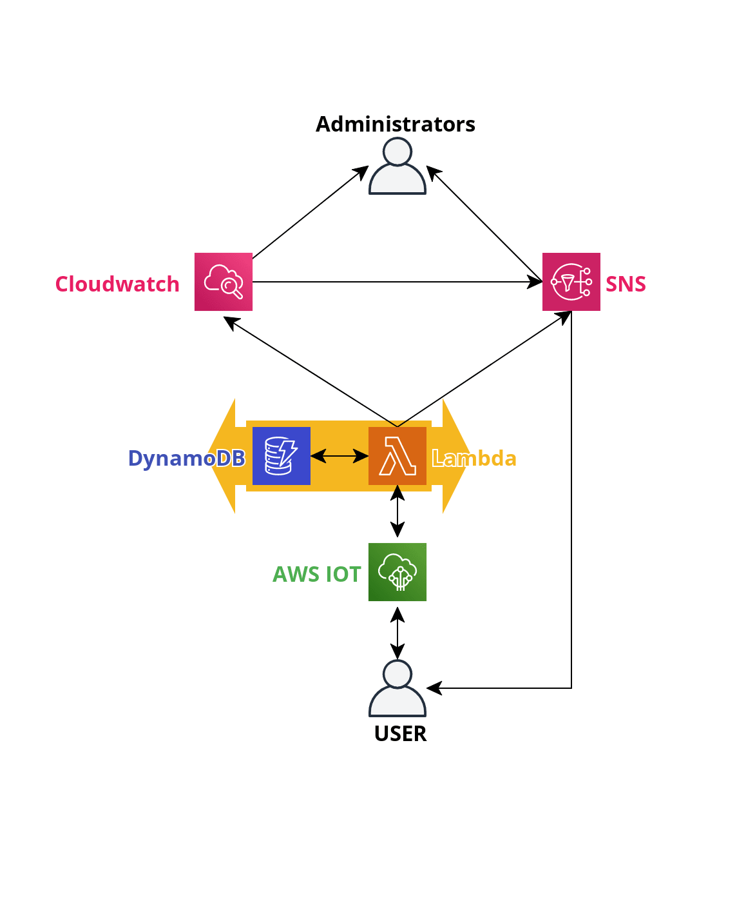

### Timing Diagram:

## Brief description

As seen, our IR sensor that is connected to the Esp32 detects the state of our door lock and sends the state to AWS IoT which logs the change of state in DynamoDB. Then the user can use our mobile app to check the state of the lock or view past logs of the doorlock.

# How to use

### Step 1 - Manufacturing stage
Factory executes the script, a new entry of UUID is generated alongside a customized arduino code to be flashed to the smart device
The UUID is then printed onto a sticker that is stuck onto the packaging of the smart device
A remove only cover is applied on the sticker, to ensure against tempering

### Step 2 - User telegram setup stage
User downloads and setups their telegram account. During setup, telegram binds the user to their phone number, and requires a two factor authentication in order to access that particular account
user then enters the application redirection link into a browser of their choice, link:"http://t.me/notjustasimplebot"

### Step 3 - User bot setup stage
User then proceeds to enter "/start" to enable the bot
Up until this point, the user will not be able to send any commands or receive any messages from the device
User enters "/register" followed by their device UUID, which can be found on the UUID sticker on the packaging of the device. example: /register 3277024e4170faa93196f30e5e40e608
When the user keys in the command, there are several outputs that the user might receive. 
   1. Registration successful : The user has successfully registered their user id into the database, and can start receiving updates and sending commands to the associated smart device
   2. Wrong lock id : User has keyed in the wrong information and is advised to check their input
   3. Already registered to you : The smart device with that UUID has already been registered to the user

### Step 4 - Use stage
Everything up until this point has been setup correctly, moving on to using the smart device
Upon device connection to the internet, the device will be able to perform a few tasks split into two category : Automatic and User driven
The device will inform the user through telegram message when an change has occured. If the door is unlocked; it will send the exact message to the user, and vice versa
When the device has been disconnected from the internet, or has been tampered with, an error message will be sent to the user as well as the administrators

# Electronics Assembly

Our hardware consist of the following:

1. Esp32 (2pcs)
2. IR sensor - KY-032 (2pcs)
3. Copper Strip Board (size)

Schematic:

Picture of finished circuit board:

# Circuit diagram

Alternatively you can do PCB milling or PCB etching you can use the Gerber files located at `./schematic/doorlook-gerber` to reproduce the schematic:

# Mechanical Assembly

We assembled our electronics with the following materials:

1. Custom 3d printed chasis (available in source code)
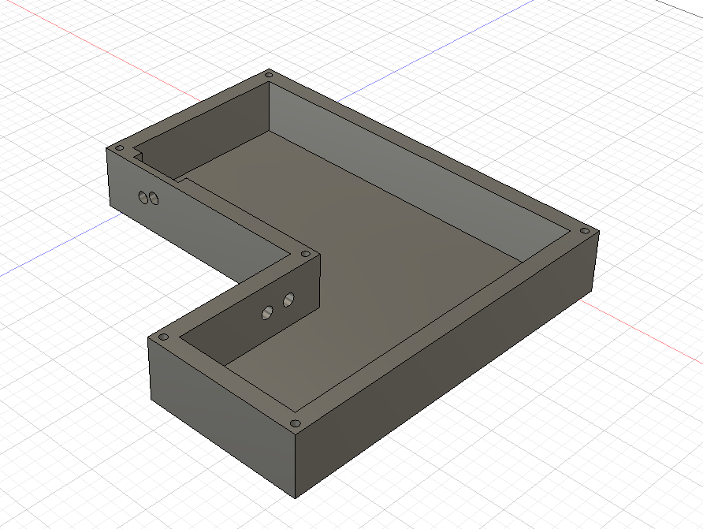
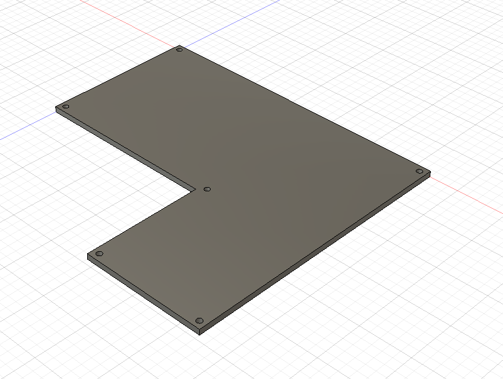
2. T5 Torx screws (6pcs)

The following is a short video on the physical assembly of the 3d printed case with the electronics. The 3d model is located at `./assembly/doorlook-3dmodel.dxf`
### Interior of device
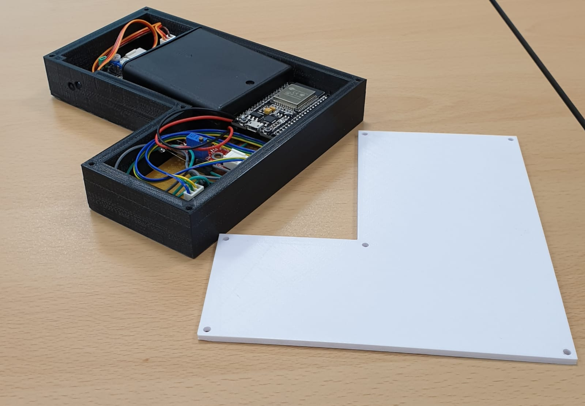
# Arduino Code

Our Arduino code is located at `./code/doorlook-arduino.ino`, and does primarily 2 things; reading the state of the sensor then sending it to AWS Iot Core. However we also included redundancy features that we explain more in detail in item ....
Do howeve

# Compliance checklist

### Dread risk assessment
|                            | DREAD RISK       |                 |                |                |                |              |
|----------------------------|------------------|-----------------|----------------|----------------|----------------|--------------|
| Attack                     | Damage Potential | Reproducibility | Exploitability | Affected Users | Discoverablity | Risk (MAX=5) |
| Spoofing                   |                  |                 |                |                |                |              |
| WiFi access                | 3                | 5               | 4              | 3              | 1              | 3.2          |
| Unauth connection (stolen) | 2                | 4               | 1              | 1              | 1              | 1.8          |
| Cloning of hardware        | 5                | 4               | 4              | 2              | 4              | 3.8          |
| Session hijack             | 4                | 1               | 3              | 1              | 3              | 2.4          |
| Tampering                  |                  |                 |                |                |                |              |
| Physical                   | 2                | 1               | 3              | 1              | 1              | 1.6          |
| RF jamming                 | 4                | 4               | 4              | 2              | 1              | 3            |
| Repudation                 |                  |                 |                |                |                |              |
| Hardware Error             | 3                | 1               | 1              | 1              | 1              | 1.4          |
| Man in the middle          | 5                | 2               | 4              | 1              | 5              | 3.4          |
| Modified data              | 5                | 2               | 5              | 1              | 4              | 3.4          |
| Information Disclosure     |                  |                 |                |                |                |              |
| Door data leak             | 4                | 3               | 4              | 2              | 5              | 3.6          |
| UUID Leak                  | 5                | 1               | 4              | 2              | 5              | 3.4          |
| User ID Leak               | 4                | 1               | 4              | 4              | 3              | 3.2          |
| Denial of Service          |                  |                 |                |                |                |              |
| Flooding                   | 5                | 5               | 4              | 4              | 1              | 3.8          |
| DDOS of API                | 5                | 5               | 4              | 5              | 1              | 4            |
| Escalation of Privilege    |                  |                 |                |                |                |              |
| Unregister account         | 5                | 2               | 3              | 1              | 1              | 2.4          |
| Redirect notification      | 4                | 1               | 3              | 1              | 1              | 2            |
| Misc                       |                  |                 |                |                |                |              |
| Botnet inclusion           | 3                | 1               | 2              | 1              | 5              | 2.4          |
| Cryptojacking              | 3                | 1               | 4              | 1              | 4              | 2.6          |
| Social engineering         | 5                | 5               | 5              | 3              | 2              | 4            |

### TR64 Checklist

| Attack       | Checklist                                                                                                                                   | TR64 Code                     | Description                                                                                                           |
|--------------|---------------------------------------------------------------------------------------------------------------------------------------------|-------------------------------|-----------------------------------------------------------------------------------------------------------------------|
| ESP32        | Tamper-proof Enclosure, No exposed joints/connectors to open device, Secure Communications                                                  | AP-04 AP-03 RS-03             | Enclosure is not easily tampered with, Exposed ports are sealed off, ESP32 uses MQTTS                                 |
| Telegram API | No disclosure of secure keys, alteration and extraction. Secure crypto processor is employed, client is identified with an unique ID        | FP-01 FP-03 IA-02 AP-02       | Secure transmission of JSON through HTTPS with encryption. Client ID is generated from user initialization of the bot |
| AWS system   | Unique non-modifiable IDs. IDs are hashed with salt. Identify and analyse threats.  Data is not stored in clear text, Secure Communications | IA-03 IA-01 CS-01 DP-03 RS-03 | Secure unique ids created upon device manufacture, salt generated alongside creation                                  |
|              |                                                                                                                                             |                               |                                                                                                                       |
|              |                                                                                                                                             |                               |                                                                                                                       |
|              |                                                                                                                                             |                               |                                                                                                                       |
|              |                                                                                                                                             |                               |                                                                                                                       |
